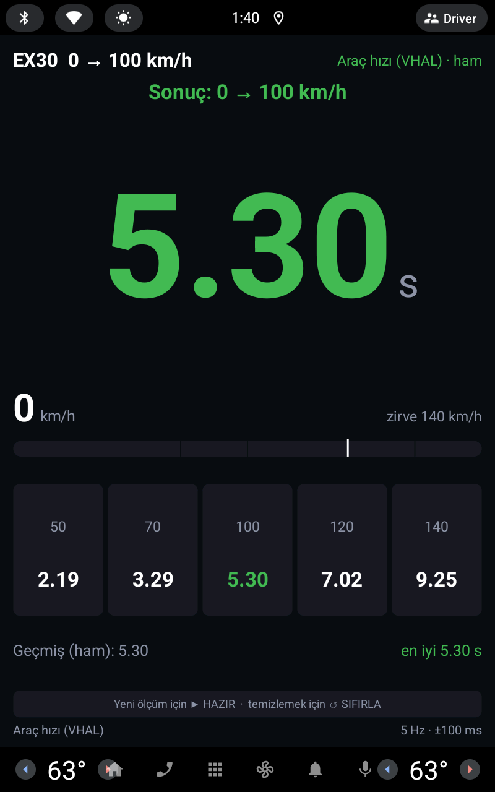
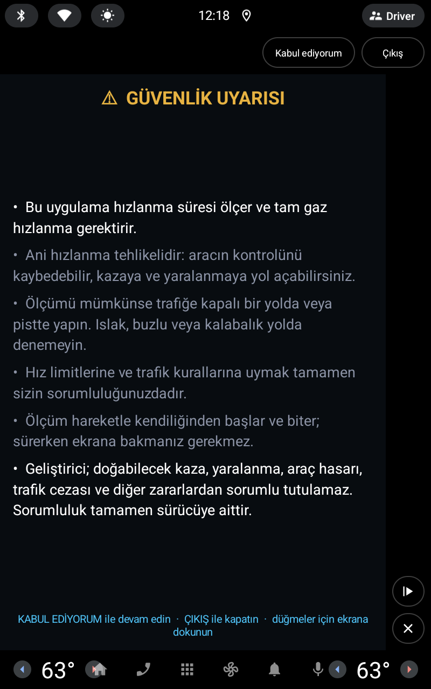
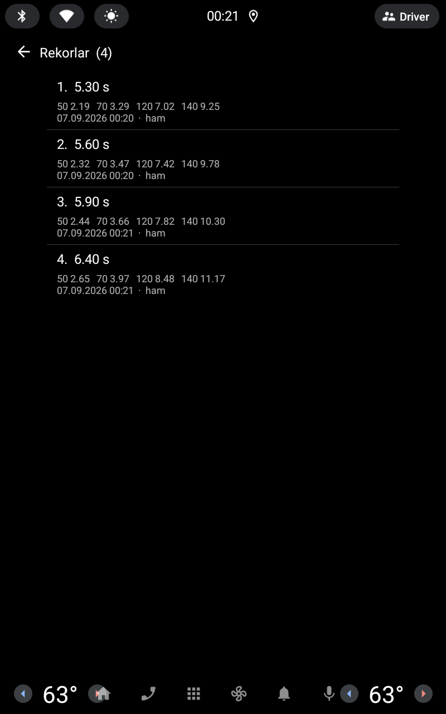
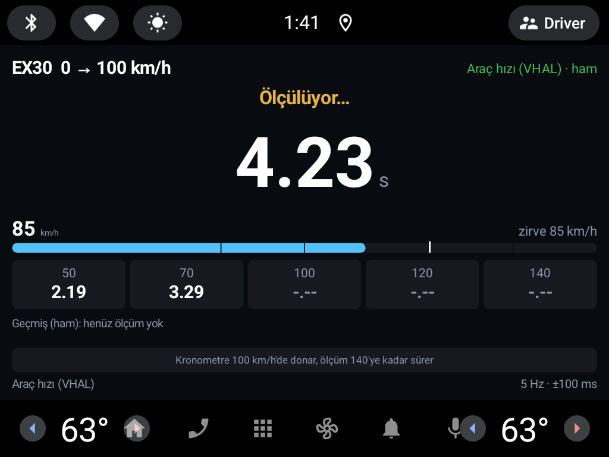

# EX30 0-100

[English](README.md) · **Türkçe**

**Volvo EX30** için, aracın **Android Automotive OS** ekranında çalışan hızlanma
kronometresi. Araç dururken **Hazır**'a basılır; araç hareket ettiği anda
kronometre kendiliğinden başlar ve **50 · 70 · 100 · 120 · 140 km/h**
baremlerindeki süreler ölçülür. Telefon ya da ek donanım gerekmez: aracın kendi
hız verisini kullanır.

> **Resmî olmayan proje.** Volvo Cars ile bağlantısı yoktur, Volvo tarafından
> onaylanmamış veya desteklenmemektedir. "Volvo" ve "EX30" sahiplerinin ticari
> markalarıdır; burada yalnızca uyumluluğu belirtmek için kullanılır.
> Bkz. [Sorumluluk reddi](#sorumluluk-reddi).

<p>
  
  
  
</p>
<p>
  
</p>

<sub>Ekran görüntüleri AAOS emülatöründe, debug simülatörüyle alındı.</sub>

## Nasıl ölçer

| Aşama | Davranış |
|---|---|
| **Hazır** | Araç duruyorsa doğrudan kuruma geçer; hareket halindeyse önce "Aracı tam durdurun" der. |
| **Kalkış** | Hız 0.8 km/h'yi aştığı anda ölçüm başlar. Kalkış anı iki örnek arasına düştüğü için önce v=0'a doğrusal geri interpolasyon yapılır, sonra bir sonraki örnekten hesaplanan ivmeyle rafine edilir. |
| **Baremler** | Her barem, hızın o değeri geçtiği an örnekler arası doğrusal interpolasyonla bulunur; sonuç örnekleme aralığına yuvarlanmaz. |
| **Bitiş** | 140 km/h'de biter. Araç 1.5 sn'den uzun durursa ya da **30 sn** dolarsa ölçüm kapanır; o ana kadar yakalanan baremler ekranda kalır. 100 km/h yakalanmışsa sonuç geçerli sayılır. |
| **Sıfırla** | Süren ölçümü iptal eder. Ölçüm yokken basılırsa geçmişi temizler. |

Zaman ekseni olarak `CarPropertyValue.getTimestamp()` (VHAL'in ölçüm anı)
kullanılır; callback'in uygulamaya ulaşma gecikmesi sonuca karışmaz. Aktif kaynak
ve ölçülen örnekleme hızı (`10 Hz · ±50 ms` gibi) her zaman ekranda yazar.

### Ham hız mı, gösterge hızı mı

Bir düğme ölçümün hangi kanala dayanacağını seçer:

| Referans | Property | Ne demek |
|---|---|---|
| **Ham hız** (varsayılan) | `PERF_VEHICLE_SPEED` | Aracın gerçek hızı. Doğru 0-100 süresi için bu. |
| Gösterge hızı | `PERF_VEHICLE_SPEED_DISPLAY` | Kadranda yazan değer. Gerçek hızın altını göstermez, yani ondan ölçülen süre daha kısa çıkar. |

İki kanal da sürekli dinlenir; seçilmeyen kanalın anlık değeri hızın yanında
gösterilir, böylece aradaki fark canlı görülür. Geçmiş referans bazında tutulur.

### Hız kaynakları (öncelik sırasıyla)

| # | Kaynak | Nasıl |
|---|---|---|
| 1 | **VHAL** | `CarPropertyManager` → `PERF_VEHICLE_SPEED`, aracın kabul ettiği en yüksek hızda (100 → 1 Hz) sürekli dinleyici. Kayıt çalışmazsa 25 ms'lik doğrudan okumaya düşer. |
| 2 | **Host** | Car App Library `CarInfo.addSpeedListener`. VHAL 3 sn sessiz kalırsa açılır. |
| 3 | **GPS** | `LocationManager` hız bileşeni. 6 sn içinde araç hızı gelmezse açılır; "düşük hassasiyet" olarak işaretlenir. |

### Rekorlar

**Rekorlar** düğmesi en iyi 20 ölçümü açar. Bir ölçüm ancak ilk 20'ye giriyorsa
kaydedilir; liste doluyken yeni kayıt girerse en kötü süre düşer. Her kayıtta
bütün baremler, tarih, hız referansı ve örnekleme çözünürlüğü tutulur. Bir kayda
dokununca ana ekrandaki şema o kaydı gösterir (canlı sonuçtan ayrılsın diye mavi).

### Açılış uyarısı

Uygulama **her açılışta** bir güvenlik uyarısı gösterir. Kabul edilmeden izin
istenmez ve ölçüm başlamaz; **Çıkış** uygulamayı kapatır.

## Derlemeden önce doldurmanız gerekenler

Kişisel değerler bu depodan çıkarıldı. Kendi değerinizi girmeniz gereken her
yer **BÜYÜK HARFLİ** bir yorumla işaretlidir.

| Ne | Nerede | Zorunlu mu? |
|---|---|---|
| Paket adı (`applicationId`) | `automotive/build.gradle.kts` | Kendi release derlemeniz için **evet**. Google Play `com.example.*` kabul etmez |
| İmza anahtarı | `keystore.properties.example` → `keystore.properties` olarak kopyalayın | Yalnızca imzalı release için |

`keystore.properties`, `*.jks`, `*.aab` ve `*.apk` `.gitignore` içindedir.
**Bunları asla depoya eklemeyin.**

## Derleme

Gereksinimler: Android Studio (JDK 17), Android SDK 35.

```powershell
$env:JAVA_HOME = "C:\Program Files\Android\Android Studio\jbr"
.\gradlew.bat :automotive:assembleDebug       # emülatör testi
.\gradlew.bat :automotive:bundleRelease       # imzalı AAB (keystore.properties gerekir)
```

## Araca nasıl kurulur

- **Emülatör** (AAOS'ta sürücü profili genelde **user 10**):

  ```bash
  PKG=com.example.ex30launch   # ya da kendi applicationId'niz
  adb install -r -t automotive/build/outputs/apk/debug/automotive-debug.apk
  adb shell pm grant --user 10 $PKG android.car.permission.CAR_SPEED
  adb shell pm grant --user 10 $PKG android.permission.ACCESS_FINE_LOCATION
  adb shell am start --user 10 -n "$PKG/androidx.car.app.activity.CarAppActivity"
  ```

- **Gerçek araç:** bildiğimiz kadarıyla seri üretim araçlar ADB ile uygulama
  yüklemeye izin vermiyor. Pratik yol, **kendi Google Play Console** hesabınız →
  *Dahili test* kanalı; kendi paket adınız ve imza anahtarınızla.

### Debug kancaları (yalnızca emülatör)

Emülatör (user build) hız enjeksiyonuna izin vermiyor, host da `adb shell input
tap` ile gelen dokunuşlarda düğme isabeti üretmiyor. Bu yüzden **debug
derlemesi** bir yayını dinler (release'te kurulmaz):

```bash
adb shell am broadcast --user 10 -p $PKG -a $PKG.DEBUG --es cmd accept                 # açılış uyarısını geç
adb shell am broadcast --user 10 -p $PKG -a $PKG.DEBUG --es cmd sim --ef target 5.3    # sahte 5.3 sn'lik hızlanma
adb shell am broadcast --user 10 -p $PKG -a $PKG.DEBUG --es cmd arm
adb shell am broadcast --user 10 -p $PKG -a $PKG.DEBUG --es cmd reset
adb shell am broadcast --user 10 -p $PKG -a $PKG.DEBUG --es cmd ref                    # ham <-> gösterge hızı
adb shell am broadcast --user 10 -p $PKG -a $PKG.DEBUG --es cmd records                # rekor listesini aç
adb shell am broadcast --user 10 -p $PKG -a $PKG.DEBUG --es cmd seed --ei count 25     # sahte kayıt üret
adb shell am broadcast --user 10 -p $PKG -a $PKG.DEBUG --es cmd clearrec
```

Doğrulama: hedef 5.300 sn verilen simülasyonda uygulama **5.3004 sn** ölçtü.

## Dosyalar

| Dosya | İş |
|---|---|
| `SprintTimer.kt` | Durum makinesi, kalkış anı kestirimi, barem interpolasyonu, geçmiş |
| `RecordStore.kt` | En iyi 20 kaydın kalıcı saklanması (SharedPreferences + JSON) |
| `RecordsScreen.kt` | Rekor listesi (`ListTemplate`, tıklanabilir satırlar, sayfalama) |
| `SpeedHub.kt` | Kaynak önceliği, ham/gösterge kanal seçimi, örnekleme aralığı ölçümü |
| `CarPropertySpeedSource.kt` | `android.car` yansıma sondası (VHAL dinleyicisi + yedek okuma) |
| `FallbackSpeedSources.kt` | Car App Library ve GPS yedekleri |
| `SprintRenderer.kt` | Surface çizimi: ölçüm ekranı ve açılış uyarısı |
| `SprintScreen.kt` | Açılış uyarısı, izin akışı, NavigationTemplate, ActionStrip'ler |
| `SprintDebugHooks.kt` | Yalnızca debug: yayın kancaları |

Düğmeler host'un kontrol çubuklarında duruyor, çünkü host çizim yüzeyine gelen
dokunuşları uygulamaya iletmiyor.

Arayüz dili şimdilik yalnızca **Türkçe** (metinler kodda). Kod yorumları
çoğunlukla Türkçedir; bazıları bu depoda bulunmayan dahili geliştirme notlarına
(`prompt.md`) atıf yapar.

## Gizlilik

İnternet izni yoktur: hiçbir veri araçtan çıkamaz. Rekorlar yalnızca uygulamanın
özel alanında saklanır. Reklam, analitik veya kullanıcı hesabı yoktur.

## Sorumluluk reddi

Bu yazılım **"olduğu gibi", hiçbir garanti olmaksızın** sunulur. Ani hızlanma
tehlikelidir. Ölçümü yalnızca yasal ve güvenli koşullarda, tercihen trafiğe
kapalı bir pistte yapın; trafik kurallarına ve hız limitlerine uyun. Geliştirici;
kaza, yaralanma, araç hasarı, trafik cezası ve diğer zararlardan sorumlu
tutulamaz. Sorumluluk tamamen sürücüye aittir. Süreler tahminidir ve hatalı
olabilir.

## Lisans

Copyright (C) 2026 Anıl Erke

Bu program özgür yazılımdır: Özgür Yazılım Vakfı tarafından yayımlanan **GNU Genel
Kamu Lisansı**'nın 3. sürümü ya da (tercihinize göre) daha sonraki bir sürümü
koşulları altında yeniden dağıtabilir ve/veya değiştirebilirsiniz
(`GPL-3.0-or-later`).

Bu program faydalı olması umuduyla dağıtılmaktadır, ancak **HİÇBİR GARANTİSİ
YOKTUR**; SATILABİLİRLİK veya BELİRLİ BİR AMACA UYGUNLUK zımni garantisi dahi
yoktur. Bağlayıcı olan, [LICENSE](LICENSE) dosyasındaki İngilizce tam metindir.

Kısacası: bu kodu kullanabilir, inceleyebilir, değiştirebilir ve paylaşabilirsiniz.
Değiştirilmiş bir sürümü dağıtırsanız (uygulama mağazasında yayınlamak dahil),
onun kaynak kodunu da aynı lisansla açmanız gerekir.
